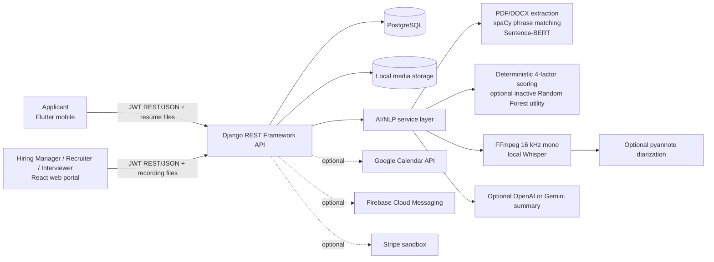

# HRRecruit Presentation Source of Truth

> **Code-verification scope:** repository commit `dd82ff0e1e8fc67d0127cd2efea5f8c3236ba6d4` on the checked-out `work` branch, examined on 2026-07-27. No local `main` branch or remote branch was available in this checkout; `work` was the only branch listed. Therefore, this document describes the implementation at that exact commit rather than claiming that it matches an unverifiable remote `main` tip.
>
> **Authority rule used here:** executable source, models, migrations, API routes, settings, dependency manifests, and current React/Flutter routes take priority over older prose documents. A feature is called **implemented** when a code path exists; **configured** or **operational in the presentation environment** is stated only when repository evidence supports it. There is no committed runtime `.env`, PostgreSQL data, provider credential, training dataset, or deployment manifest, so live provider readiness and production deployment are not verifiable from the repository.

This reference is designed for a 30-minute FYP presentation (approximately 10–15 slides) that emphasizes algorithms, architecture, and the end-to-end recruitment decision workflow rather than registration, validation, or ordinary CRUD.

---

## 1. Current project overview

### Project purpose

HRRecruit is an AI-assisted recruitment management system. It joins vacancy definition, applicant resume intake, explainable resume scoring/ranking, interview coordination, transcript and summary support, human evaluation, job-level hiring approval, and offer response in one workflow. The AI components provide evidence and prioritization; human users submit evaluations, choose candidates, approve decisions, approve offers, and accept or decline offers.

### Target users

| Presentation name | Code value | Primary surface | Current responsibility |
|---|---|---|---|
| Hiring Manager | `hr_head` | React web portal | Organization/team administration, requisitions, job-level hiring decision approval, offer approval, analytics and billing |
| Recruiter | `recruiter` | React web portal | Jobs and requirements, application screening/ranking, interview assignment, candidate comparison, job-level recommendation, offer preparation/sending |
| Interviewer | `interviewer` | React web portal | Assigned applicants/interviews, availability, recording upload, transcription/summary review, structured evaluation |
| Applicant | `applicant` | Flutter mobile app | Job discovery/application, resume selection, interview scheduling, invitations, application tracking, offer acceptance/decline |

The database value remains `hr_head`, while its display label and current web route name are **Hiring Manager**. Do not present “HR Head” as a separate fifth role.

### Main recruitment problems addressed

1. **High resume-review volume:** local extraction plus multi-factor scoring gives recruiters a sortable, explainable first review.
2. **Inconsistent requirement comparison:** job requirements become explicit semantic, skill, experience, and education signals.
3. **Fragmented interview evidence:** recordings, transcripts, optional diarization, editable AI summaries, and scorecards are associated with the interview.
4. **Uncontrolled hiring decisions:** the implemented current path is a job-level recruiter recommendation followed by Hiring Manager review.
5. **Offer governance:** offers require Hiring Manager approval before recruiter delivery and applicant response.

### Final implemented recruitment workflow

1. Hiring Manager manages the organization/team and may create/approve a job requisition.
2. Recruiter creates a job posting, requirements, and evaluation scorecard; the posting is published/opened.
3. Applicant discovers a job in Flutter, selects/uploads a PDF or DOCX resume, and applies. The application stores a snapshot of the selected resume.
4. Recruiter triggers screening. The backend extracts resume text and evidence, calculates four component scores and the weighted final score, stores explainability JSON, and exposes score-based ranking.
5. Recruiter reviews the evidence and assigns an interviewer/panel or scheduling request.
6. Applicant accepts/declines an invitation or books an offered slot. Optional Google Calendar sync can create an event/Meet link when configured.
7. Assigned interviewer uploads interview audio. A two-worker in-process thread pool preprocesses it and runs local Whisper in the background.
8. Optional pyannote diarization aligns anonymous speaker IDs to Whisper segment/word timestamps. A real plain transcript remains usable when diarization is disabled or clearly fails.
9. After a transcript reaches `COMPLETED`, the interviewer requests a structured summary from configured OpenAI or Gemini, reviews/edits it, and submits the weighted scorecard evaluation.
10. Recruiter closes intake, compares eligible applicants, and submits one job-level `recommend_hire` (selected ordered applicants) or `recommend_no_hire` decision.
11. Hiring Manager approves or returns the job-level decision.
12. For an approved selected candidate, recruiter drafts an offer; Hiring Manager approves/disapproves it; recruiter sends it; applicant accepts or declines in Flutter.

**Important current-code caveat:** the status model was simplified to only `under_review` and `rejected`. Screening below 60 currently changes the application to `rejected`, even though the service note says the recruiter retains the final decision. This is inconsistent with the stated human-review safeguard and with older documents that say `screened_not_qualified`; it must be presented honestly, not hidden.

---

## 2. Current system architecture

### Implemented layers

- **React web portal:** Vite/React, Material UI, React Router, Axios and Zustand. It contains role-guarded Hiring Manager, Recruiter, and Interviewer routes, analytics charts, screening explainability, transcription/summary, hiring decisions, and offers.
- **Flutter applicant app:** Flutter/Dart using Dio, secure token storage, GoRouter, Provider, file picker and URL launcher. Applicant workflow screens cover jobs, applications, invitations, interviews, notifications and offers.
- **Django REST Framework backend:** role-protected REST APIs grouped into the mandated Django apps. JWT is the only configured DRF authentication class and `IsAuthenticated` is the global default permission.
- **PostgreSQL:** the only configured Django database engine. Models use `BigAutoField` globally, with some explicit BigAutoField declarations.
- **AI/NLP service layer:** dedicated `apps/ai_services` modules handle extraction, preprocessing, Sentence-BERT similarity, deterministic scoring, optional trained-model utilities, local Whisper, pyannote alignment, and LLM summaries.
- **Local media:** resumes, application resume snapshots, recordings and offer letters use Django file fields and local `MEDIA_ROOT` by default.

### Genuinely implemented external/local integrations

| Integration | Code status | Configuration/operational caveat |
|---|---|---|
| Local OpenAI Whisper package | Real implementation | Default provider is `local_whisper`; requires Python dependencies, FFmpeg/ffprobe, model download/cache and sufficient compute |
| pyannote.audio + Hugging Face model | Real optional implementation | Disabled by default; needs accepted gated model terms and `PYANNOTE_AUTH_TOKEN` |
| OpenAI summary API | Real optional implementation | Supported by code; needs `OPENAI_API_KEY`; no credential is committed |
| Google Gemini summary API | Real optional implementation | Supported by code and selected in `.env.example`; needs `GEMINI_API_KEY`; configured model availability cannot be verified offline |
| Google Calendar OAuth/API | Real optional implementation | OAuth credential storage, connection/callback and event synchronization exist; disabled unless configured |
| Firebase Cloud Messaging | Real optional implementation | Backend Firebase Admin and Flutter messaging code exist; disabled unless credentials/configuration are supplied |
| Stripe Checkout/webhook | Real optional **sandbox** implementation | Code and tests exist; keys/webhook configuration and a live sandbox account are not verifiable |
| Email | Implemented | Console backend is the default; SMTP may be configured |

Do not call OpenAI, Gemini, Calendar, Firebase, or Stripe “active production services” based only on their code. No committed credentials or runtime environment proves that.

### Presentation-friendly architecture flow



---

## 3. Current user roles and responsibilities

### Hiring Manager (`hr_head`)

- Code display label: `Hiring Manager`; current web route prefix: `/hiring-manager/...`.
- Creates/manages organization context and team members and handles requisitions/subscription surfaces.
- Views organization-wide applicant information.
- Reviews job-level hiring decisions submitted by recruiters.
- Separately approves/disapproves offer terms before an offer may be sent.

### Recruiter (`recruiter`)

- Current web route prefix: `/recruiter/...`.
- Owns job postings within the recruiter’s active organization membership.
- Configures requirements and evaluation forms, triggers screening, ranks/compares applications, and assigns interviews.
- Sees applications only for jobs both in the active organization and owned by that recruiter in the main application querysets.
- Submits the job-level recommendation and prepares/sends approved offers.

### Interviewer (`interviewer`)

- Current web route prefix: `/interviewer/...`.
- Sees assigned applicants/interviews, including primary or panel assignments where the relevant query supports them.
- Uploads recordings and triggers transcription/summary for visible assigned interviews.
- Reviews/edits the summary and submits one evaluation per interviewer/interview.

### Applicant (`applicant`)

- Current implementation is the Flutter applicant application rather than a role-specific React portal.
- Discovers/saves jobs, manages profile/resumes, applies, sees only owned applications/invitations/interviews/notifications/offers, books interview slots, and responds to offers.

---

## 4. Core implemented modules

### Job posting

Recruiter job posting models/APIs and React pages support job details, status, department, vacancies, deadline, requirements and scorecard configuration. Requisition and approval concepts also exist. Recruiter ownership and organization membership are checked in backend query helpers.

### Application and resume handling

Applicants can maintain resume records and select one during application. The backend copies the exact selected file into `application_resumes/`, preserving a per-application snapshot. Screening supports text PDFs and DOCX only; there is no OCR for scanned PDFs.

### AI resume screening and ranking

Recruiter-triggered screening persists extracted text, skills, experience, education, component scores, weighted final score and a rich explanation JSON. Ranking APIs/UI sort by stored `final_score`; this is deterministic scoring, not automatic final selection.

### Interview scheduling

The backend includes direct and applicant self-scheduling flows, availability patterns/overrides, scheduling requests, primary/panel interviewers, invitation responses, generated slots, collision checks, calendar event records, and optional real Google Calendar synchronization.

### Interview transcription

Assigned interviewers upload validated audio and request transcription. The endpoint immediately creates a `PENDING` transcript, then starts an in-process background thread. The system uses real local Whisper only in the runtime service, records processing/quality state, and stores errors instead of substituting a fake transcript.

### Speaker diarization

When enabled and configured, pyannote produces speaker turns. Whisper segments—preferably word timestamps—are assigned to the turn with greatest time overlap. Stored/displayed labels are anonymous diarizer IDs such as `SPEAKER_00`; current formatting deliberately does not infer that an ID is the interviewer or applicant.

There is an unused `map_speakers_to_roles()` heuristic in the module that guesses roles using questions, keywords and duration and labels all additional speakers as Applicant. It is not called by the current transcription pipeline, but it remains code capable of fabricated participant-role labels if reused. Under the required policy, it should be called out as risky/dead code rather than demonstrated.

### AI interview summary

A summary can be generated only for a transcript whose status is `COMPLETED`. The configured OpenAI or Gemini provider must return all five structured fields. Missing keys, empty fields, invalid JSON, an invalid score, missing credentials, or provider errors produce a clear API failure; no runtime mock summary is created by the current service.

### Evaluations

Recruiters configure weighted criteria. Each assigned interviewer can submit one evaluation containing every criterion, individual scores/comments, total weighted score and an overall comment. The API validates criterion completeness/ranges and records the evaluator.

### Job-level hiring decision

`JobHiringDecision` is the active presentation workflow: recruiter creates/submits a job-level recommendation and ordered candidate items. An old applicant-level `HiringDecision` model and endpoints remain for compatibility, but new applicant-level submission is explicitly rejected. Present the job-level model, not the legacy flow.

### Hiring Manager approval

The Hiring Manager sees organization-scoped job decisions pending approval and approves or returns them with remarks. Only approved, selected decision items are eligible for an offer.

### Job offer and applicant response

Recruiter creates an offer in `pending_hr_approval`; Hiring Manager approves/disapproves; recruiter can revise a disapproved offer or send an approved one; applicant accepts/declines; recruiter can withdraw a sent offer. Applicant response and notifications update the workflow. The current implementation does not include cryptographic e-signature.

---

## 5. Resume screening algorithm

### Actual text extraction process

1. Resolve the application snapshot first, then the selected resume, then the applicant profile resume.
2. Dispatch by file suffix.
3. PDF: PyMuPDF (`fitz`) opens the local file and concatenates page text.
4. DOCX: `python-docx` concatenates paragraphs and all table-cell text.
5. Strip blank lines/line-edge whitespace.
6. Missing files, unsupported suffixes, missing parser dependencies or parsing failures raise a clean extraction error. There is no fabricated fallback text and no OCR.

### Skill extraction

- Matching text is lowercased, punctuation-normalized and whitespace-normalized while retaining `+`, `#`, and `.` for skills such as C++, C# and Node.js.
- A finite in-code skill dictionary contains canonical keys and aliases.
- spaCy `en_core_web_sm` plus `PhraseMatcher` is required for dictionary extraction; unavailable spaCy/model or matching errors raise `AIServiceUnavailable` rather than returning a fake score.
- Explicit configured skill requirements not in the dictionary are retained as normalized phrases and matched against resume text using case-insensitive whole-phrase regular expressions.
- Skill score is weighted coverage when requirement weights exist; otherwise it is exact required-skill coverage. No required skills gives 100.

### Education extraction

The extractor uses deterministic regex/dictionary signals for education levels and known fields of study. The score compares ranked levels, then—when a required field exists—uses 70% level and 30% field coverage. No required education gives full level credit. This is heuristic extraction, not a trained degree parser.

### Experience extraction

The extractor uses regex patterns for numeric years and role/title vocabulary. The score caps years coverage at 100%; when required roles exist, it uses 80% year coverage and 20% role coverage. No required years/roles results in full applicable credit. It does not reliably reconstruct overlapping employment dates or career chronology.

### Sentence-BERT semantic matching

- Model: `all-MiniLM-L6-v2` through `sentence-transformers`.
- The normalized resume and combined job title/description/requirements are encoded together.
- Embeddings are normalized and their dot product is treated as cosine similarity, clamped and scaled to 0–100.
- The model instance is process-cached with `lru_cache(maxsize=1)`.
- Blank input returns 0. The current implementation has no semantic mock/lexical fallback; dependency/model download/load/inference errors propagate as clear failures.

### Exact skill matching

Configured skill phrases are checked with whole-boundary regexes before semantic scoring, including phrases outside the built-in dictionary. Matched and missing required skills are returned and stored for explanation.

### Current trained ML model, if actively used

A committed Random Forest artifact and training command exist, but **the active application screening service does not import or call `build_ml_screening_result()`**. Current ranking uses the deterministic stored `final_score`. Therefore:

- It is accurate to say “a trained Random Forest experiment/artifact is present.”
- It is inaccurate to say “the production/current screening score is generated by the trained model.”
- The unused utility defines a separate hybrid formula (50% ML, 20% semantic, 15% skills, 10% experience, 5% education), but that hybrid score is not persisted by the current screening path.

### Exact features supplied to the trained model utility

In this exact order:

1. `semantic_score`
2. `skill_score`
3. `experience_score`
4. `education_score`
5. `rule_based_score`
6. `matched_skill_count`
7. `missing_skill_count`
8. `skill_coverage_ratio`
9. `experience_gap_years`
10. `education_gap_levels`
11. `resume_word_count`
12. `job_word_count`

These are engineered scores/counts rather than raw resume embeddings supplied directly to the Random Forest.

### Exact scoring formula still used

```text
final_score = 0.4 × semantic_score
            + 0.3 × skill_score
            + 0.2 × experience_score
            + 0.1 × education_score
```

All components and the rounded result are on a 0–100 scale. This is the actual score saved to `JobApplication.final_score` and used by current ranking.

### Qualification threshold logic

- Constant threshold: **60.0**.
- `final_score >= 60`: qualification explanation is `qualified`; application becomes `under_review`.
- `final_score < 60`: explanation is `not_qualified`; **current service changes application to `rejected`**.
- Older migrations/docs mention `screened_not_qualified`, but that status was removed by later status-simplification migrations.

### Human review safeguards—and the current conflict

- The score explanation and transition note say AI screening supports recruiter review.
- Ranking, shortlist/reject actions, interview assignment, evaluations, job-level selection, Hiring Manager decision approval, offer approval and applicant acceptance are human/API actions.
- The summary prompt explicitly forbids hiring/rejection/approval/final decisions.
- **However, below-threshold screening currently writes the terminal-looking `rejected` status automatically.** This does not satisfy the requested “do not automatically reject” policy even though a recruiter can review evidence. State this as an implementation limitation/conflict.

### Explainability output

Stored `score_explanation` includes formula and score source, model-version label for the deterministic method, threshold, every component and final score, qualification reason, matched/missing skills and weights, extracted/required experience with gaps/roles, extracted/required education with gaps/fields, semantic comparison source, human-readable notes, and debug counts. The React screening explanation utility/page renders these signals for recruiter review.

---

## 6. Model training details

### Verified training implementation

| Item | Code-verified fact |
|---|---|
| Algorithm/model | `sklearn.ensemble.RandomForestRegressor` |
| Version label | `resume-match-level3-v1` |
| Trees | 250 default estimators |
| Other key parameter | `min_samples_leaf=2`, `random_state=42` |
| Dataset structure | Root `labels.csv`, `resumes/`, `jobs/`; each label row references `resume_file`, `job_file`, `suitability_score` |
| Training pairs reported | 2,500 in committed metrics JSON |
| Train/test split | 80/20 (`test_size=0.2`), so nominally 2,000 train / 500 test if all 2,500 rows were used |
| MAE | 12.1292 score points |
| RMSE | 16.1589 score points |
| R² | 0.5928 |
| Artifact | `backend/apps/ai_services/model_artifacts/resume_match_model.joblib` |
| Metrics | `backend/apps/ai_services/model_artifacts/resume_match_model.metrics.json` |

### What cannot be verified

- The training ZIP/directory and its raw 2,500 pairs are **not committed**, so label provenance, class/score distribution, duplicates, demographic balance, annotation procedure, licensing and leakage cannot be independently audited.
- The joblib file could not be deserialized in the inspection environment because `joblib` was not installed. Its companion metrics and training code were inspected, but the artifact’s internal estimator state was not independently reproduced.
- No cross-validation, external validation set, fairness evaluation, calibration evaluation, or comparison baseline is implemented in the command.
- A single random 80/20 pair split can leak resume/job templates across partitions if the dataset contains related examples; grouping is not implemented.
- R² 0.5928 is moderate, while MAE ~12.13 and RMSE ~16.16 are material on a 0–100 score. Do **not** describe this model as “highly accurate.”
- Most importantly, this artifact is not invoked by current application screening, so its metrics do not validate the accuracy of the live deterministic ranking.

---

## 7. Interview transcription technology

### Actual Whisper implementation and configuration

- Package pinned in backend requirements: `openai-whisper==20250625`.
- Runtime provider default: `local_whisper`; the processing pipeline rejects other provider values even though unused OpenAI-related constants/helpers remain.
- Model default: `small`, configurable using `WHISPER_MODEL_SIZE` (which takes precedence) or `TRANSCRIPTION_MODEL`.
- Options: English, `task=transcribe`, temperature 0, word timestamps enabled, `fp16` only on CUDA, non-verbose.

### Audio preprocessing

1. Upload validates extension (`mp3`, `wav`, `m4a`, `ogg`, `webm`, `aac`), content type and 50 MB maximum.
2. SHA-256 is stored for traceability/cache reuse.
3. `ffprobe` confirms that the source contains an audio stream.
4. `ffmpeg` selects the first audio stream and converts it to PCM signed 16-bit little-endian WAV, **16 kHz, one channel**.
5. `ffprobe` verifies codec, 16,000 Hz and mono. A mismatch is a clear failure.
6. Temporary converted audio is removed unless preservation is explicitly enabled.

### Background processing and caching

- The API returns HTTP 202 after creating a `PENDING` row.
- A process-local `ThreadPoolExecutor(max_workers=2)` changes it to `PROCESSING` and later `COMPLETED`, `LOW_QUALITY`, or `FAILED`.
- This is not Celery/durable queue processing: process restart can lose queued/running work; multiple server processes have separate queues.
- Whisper models are cached in a process-level dictionary protected by a lock. CPU is the default; CUDA is selected when `torch.cuda.is_available()`.
- Complete transcripts are also reused by matching audio SHA-256, with the source transcript ID recorded.

### Speaker diarization workflow

- Disabled by default and requires pyannote.audio 3.1.1, Hugging Face token and gated model access.
- Default diarization model: `pyannote/speaker-diarization-3.1`.
- Diarized time turns are aligned to Whisper word timestamps when complete; otherwise segment-level maximum overlap is used.
- If any aligned segment remains `UNKNOWN`, diarization is marked failed.
- Current formatted labels preserve anonymous diarizer IDs and do not pretend to know real participant identities.
- A successful real plain transcript is retained when optional diarization is disabled/unavailable/failed; the status and warning/error are explicit. This is “real transcript plus clear diarization failure,” not fabricated diarization.

### Transcript storage structure

`InterviewTranscript` stores text, status, error, JSON metadata, and generation time. JSON contains plain transcript, optional speaker-labelled transcript, speaker segments, diarization status/warning, provider/mode/model/device/language, timings, audio hash/properties, conversion facts, Whisper diagnostics and quality assessment.

### Real failure behavior

- Missing audio, FFmpeg/ffprobe, Whisper package/model, empty provider output, invalid conversion, or ASR error causes `FAILED` with the error in `processing_error` and JSON; no fake transcript is saved.
- Quality checks flag replacement characters, excessive non-Latin script for the forced-English setting, suspicious repetition, low log probability, high no-speech probability and high compression ratio. A flagged transcript becomes `LOW_QUALITY` and summary generation is blocked.
- Optional diarization failure does not invalidate a valid real plain transcript; it is recorded independently.

---

## 8. AI interview summarization

### Current provider

Code supports **OpenAI** and **Google Gemini**. Code default is OpenAI `gpt-4o-mini`; `.env.example` selects Gemini `gemini-3.5-flash`. With no committed `.env` or keys, the provider actually used in a live demo cannot be verified. Confirm the demo machine’s runtime configuration and provider model availability before presenting.

### Input and output

- Input: normalized `transcript_text` from a completed transcript.
- Prompt: human decision-support only, strict structured JSON, concise/editable output.
- Required output: `strengths`, `weaknesses`, `communication_score` (0–10), `overall_impression`, `editable_summary_text`.
- Stored transparency: provider, model, generation mode, transcript excerpt, limitations, timing, human-review flag and decision boundary.

### Human editing/review

The assigned interviewer may patch all five summary fields. The editor identity is stored. Editing is blocked after an interview evaluation exists, preserving the evidence used for the submitted evaluation.

### Decision boundary

The prompt and metadata explicitly say the summary supports interviewer review and must not make the final hiring decision. Recruiter recommendation and Hiring Manager approval are separate human-controlled endpoints.

---

## 9. Security and system controls

### JWT authentication

- `djangorestframework-simplejwt` JWT authentication is globally configured.
- DRF’s global default permission is `IsAuthenticated`; public authentication/registration/webhook endpoints must opt out explicitly.
- Access token default lifetime is 60 minutes; refresh token is one day.

### Role-based authorization

- Reusable permissions encode Applicant, Recruiter, Interviewer, Hiring Manager, and combined roles.
- Many APIViews use `IsAuthenticated` plus explicit role checks/query helpers; React route guards are supplementary UX controls, not the security boundary.
- Applicant actions such as offer accept/decline verify the applicant role and ownership.

### Organization-level isolation

- Active `OrganizationMembership` links a user to one organization with a matching role.
- Recruiter application visibility requires active membership, matching organization and `job.recruiter=user`.
- Hiring Manager application/decision/offer visibility is restricted to the active membership organization.
- Interviewer search and interview/transcript actions are constrained by organization and assignments/visible interviews.

### Recruiter ownership/assignment filtering

Backend helpers use organization-scoped querysets and `get_object_or_404`, not client-supplied organization trust. Recruiter job/application management requires ownership; interviewer applicant/transcript access requires primary/panel/scheduling assignment as applicable.

### Controls not to overclaim

- A global authenticated default is strong, but security has not been independently penetration-tested here.
- `DEBUG` defaults false, although debug mode can deliberately add `*` to allowed hosts for LAN mobile testing.
- Local media serving/storage is development-oriented; repository evidence does not show hardened production object storage, malware scanning, encryption at rest, reverse-proxy controls, rate limiting, MFA, or audit-log immutability.

---

## 10. Current technology stack

### Required/current core

| Layer | Technologies verified in manifests/code |
|---|---|
| Web | React, React DOM, Vite, React Router, Material UI/Emotion, Axios, Zustand, Chart.js/react-chartjs-2, Papa Parse, SheetJS/xlsx |
| Mobile | Flutter/Dart, Dio, Provider, GoRouter, flutter_secure_storage, file_picker, url_launcher |
| Backend | Python, Django 5.2-compatible range, Django REST Framework 3.16-compatible range, SimpleJWT, django-cors-headers, python-dotenv |
| Data/files | PostgreSQL via psycopg2-binary, local Django media, Pillow |
| Resume/AI | PyMuPDF, python-docx, spaCy + external `en_core_web_sm`, sentence-transformers `all-MiniLM-L6-v2`, NumPy |
| Training artifact | scikit-learn RandomForestRegressor, joblib |
| Interview AI | FFmpeg/ffprobe system binaries, openai-whisper, PyTorch/torchaudio |
| Reporting | ReportLab |

### Optional integrations present

- pyannote.audio + Hugging Face model/token for diarization.
- OpenAI SDK or Google Gen AI SDK for summaries.
- Google Calendar API/OAuth client libraries.
- Firebase Admin backend and Firebase Flutter packages for push.
- Stripe Python SDK for sandbox checkout/webhook.
- SMTP email configuration; console email remains default.

“Present in requirements” does not prove “installed and configured on the demo machine.”

---

## 11. Strongest system contributions

1. **Explainable multi-signal resume ranking:** real document parsing, explicit skill phrases, Sentence-BERT semantics, experience/education heuristics, exact weighted formula, threshold and recruiter-facing evidence.
2. **Real local audio pipeline:** validated upload, SHA-256 traceability, verified FFmpeg 16 kHz mono conversion, cached Whisper, timing/quality diagnostics and explicit failures.
3. **Optional timestamp-aligned diarization:** pyannote turns aligned at word/segment level while preserving anonymous speaker identity and separating diarization failure from valid ASR.
4. **Human-governed decision chain:** interviewer scorecards → recruiter job-level recommendation → Hiring Manager decision approval → separate offer approval → applicant response.
5. **Cross-platform, isolated workflow:** dedicated React staff portal and Flutter applicant app backed by JWT, role checks, organization filtering and ownership/assignment querysets.

---

## 12. Honest limitations

### AI/model limitations

- Resume PDF extraction is text-layer only; scanned/image resumes have no OCR.
- Skill vocabulary is small and English-oriented; unknown exact configured phrases work, but synonyms/context outside the dictionary may be missed.
- Education/experience extraction uses heuristics, not full chronology/entity models.
- Sentence-BERT may require first-run download/internet and memory; no fallback is used.
- Deterministic weights/threshold are configured design choices, not validated predictors of successful employment.
- The Random Forest has only moderate reported metrics and is inactive in current screening.
- Below-threshold screening automatically assigns `rejected`, conflicting with the declared human-final-decision policy.
- Whisper forces English, so multilingual interviews are not supported reliably.
- Summary output can contain LLM mistakes and omits body language/tone; human verification is mandatory.

### Performance limitations

- Whisper/pyannote can be slow and memory-intensive on CPU.
- Only two in-process transcription workers exist; no durable queue, retry policy, progress percentage, distributed execution or job recovery is evident.
- Each web-server process has a separate model/transcript cache.
- A 50 MB upload maximum does not guarantee short processing duration.

### Dataset limitations

- Training source data is absent, so provenance, quality, licensing, bias and leakage cannot be audited.
- Only one split and MAE/RMSE/R² are reported; no cross-validation, fairness slices or deployment monitoring.
- The model trains partly on deterministic scores that also feed its engineered features, limiting independence.

### Local deployment limitations

- PostgreSQL and local media are configured, but there is no committed container/orchestration/production deployment proof.
- FFmpeg, spaCy model, Whisper weights and gated pyannote weights require environment preparation.
- Local files are not horizontally scalable shared object storage.
- Provider secrets are intentionally absent; current live readiness cannot be verified.

### Incomplete/optional integrations

- Google Calendar, Firebase, Stripe sandbox, OpenAI/Gemini and SMTP are implemented but configuration-dependent and not proven active.
- Diarization is disabled by default.
- Applicant-level hiring-decision models/endpoints remain alongside the newer job-level flow, although new applicant-level submission is disabled.
- No evidence of real payment production mode, e-signature, OCR, durable background jobs, or production monitoring.

### Strict AI policy audit: “real result or clear failure”

**Current runtime paths that comply:**

- Resume parsing and Sentence-BERT fail clearly; they do not invent extraction/semantic output.
- Transcription only runs local Whisper and records `FAILED`/`LOW_QUALITY`; no runtime fake transcript is generated.
- Summary only calls OpenAI/Gemini and fails on missing config/provider/invalid output; no runtime mock summary is generated.
- Current speaker-labelled transcript uses pyannote IDs, not fabricated participant roles.
- Optional diarization may fail while a real Whisper transcript succeeds; the diarization failure is explicit.

**Remaining violations, contradictions, or risks:**

1. `AGENTS.md`, `ALGORITHMS.md`, `ALGORITHMS_SOURCE.md`, `CODEX_PROMPTS.md`, `DEPLOYMENT_NOTES.md`, `FINAL_SYSTEM_GAP_REPORT.md`, `AI_ALGORITHM_GAP_REPORT.md`, and older demo/testing documents instruct or describe mock/fallback transcript/summary/semantic behavior. These are stale/contradictory under the required policy.
2. `backend/.env.example` says summaries “can use mock mode,” although current summary code has no mock branch. `STRICT_REAL_AI` and `ALLOW_MOCK_AI` settings exist but are not consulted by the current transcription or summary services; they are misleading configuration remnants.
3. Old tests in `backend/apps/interviews/tests.py` still expect mock transcript/summary responses in some cases. They conflict with current runtime code and the strict policy; test doubles used solely to prevent external calls in tests are acceptable, but assertions that production fallback output is `provider=mock` are stale.
4. `map_speakers_to_roles()` contains a heuristic that fabricates Interviewer/Applicant role mapping. It is currently unused and the active formatter explicitly avoids it, but its presence is a policy risk if reconnected.
5. `seed_demo_data.py` deliberately creates fake demo business records/resume/offer text. This is demo fixture data, not AI output, and is acceptable only when clearly labelled; never present it as a real AI result or real applicant data.

---

## 13. Recommended live demonstration flow (8–10 minutes)

### Preparation (before the audience arrives)

- Start PostgreSQL/backend/web/mobile and log in each role in separate prepared sessions.
- Use a text-based PDF/DOCX and an English audio recording under 50 MB whose content you know.
- Pre-download `en_core_web_sm`, Sentence-BERT and Whisper `small`; confirm FFmpeg/ffprobe.
- Decide whether diarization and a summary provider will be demonstrated. Verify credentials/model availability with a dry run; do not enable mock fallback.
- Prepare a second already-completed transcript/summary as a contingency **only if it is clearly identified as an earlier real run of the same file**, with stored provider/audio hash metadata.

### Timed flow

1. **0:00–0:45 — Job requirements:** open one prepared job’s requirements and scorecard. Explain that requirements drive both resume scoring and interview evaluation.
2. **0:45–2:30 — Resume screening:** trigger screening on a new application; show extracted evidence, four component scores, exact 40/30/20/10 formula, threshold and explanation.
3. **2:30–3:15 — Ranking/comparison:** open job ranking, sort by score, compare matched/missing skills and gaps. Emphasize that recruiter reviews the result.
4. **3:15–4:00 — Interview evidence:** open an assigned interview and upload/select the prepared real recording; trigger transcription. Point out 202/background status.
5. **4:00–5:15 — Real transcript:** while processing, open a previously completed real transcript and show provider/model/device, audio conversion, anonymous speaker segments/diarization status and quality state.
6. **5:15–6:15 — Summary:** generate or open the real provider summary, show the five structured fields/transparency, make one human edit, and save it.
7. **6:15–7:00 — Evaluation:** submit/show the complete weighted interviewer scorecard and overall comment.
8. **7:00–8:15 — Job decision:** as recruiter, compare eligible candidates and submit a job-level recommendation; switch to Hiring Manager and approve it with remarks.
9. **8:15–9:15 — Offer governance:** recruiter prepares the selected candidate’s offer, Hiring Manager approves, recruiter sends it.
10. **9:15–10:00 — Applicant response:** in Flutter, accept or decline the offer and show the resulting recruiter/manager notification.

If a real AI step fails, show its explicit error/status and explain the missing dependency/provider requirement. Do not switch to invented output. Avoid registration, password reset, profile validation, routine CRUD and lengthy scheduling setup.

---

## 14. Recommended 10–15 slide structure

The following **13-slide** structure fits a 30-minute slot while leaving approximately 8–10 minutes for the demo.

### Slide 1 — HRRecruit: Human-Governed AI Recruitment

**Main message:** One cross-platform workflow converts applications and interview evidence into controlled human decisions.

**Suggested visual:** Applicant-to-offer journey with four human roles.

- React portal + Flutter applicant app
- Django REST + PostgreSQL
- Explainable resume screening
- Real transcription and structured summary
- Human approval at decision and offer stages

### Slide 2 — Problem and objectives

**Main message:** Reduce screening effort and evidence fragmentation without delegating final hiring authority to AI.

**Suggested visual:** Three pain points mapped to system responses.

- High-volume, inconsistent resume review
- Disconnected interview evidence
- Weak decision/offer governance
- Need for traceable, organization-isolated workflows

### Slide 3 — Architecture

**Main message:** Two clients share a secured modular API and dedicated local/optional AI services.

**Suggested visual:** Mermaid architecture from Section 2.

- React for staff roles; Flutter for applicants
- JWT REST API and PostgreSQL
- Local media and AI/NLP layer
- Optional Calendar/FCM/Stripe/LLM integrations

### Slide 4 — Roles and implemented workflow

**Main message:** Each decision is owned by the correct human role.

**Suggested visual:** Swimlane: Applicant → Recruiter → Interviewer → Hiring Manager.

- Applicant applies/schedules/responds
- Recruiter screens, ranks and recommends
- Interviewer produces evidence/evaluation
- Hiring Manager approves decision and offer

### Slide 5 — Resume screening pipeline

**Main message:** Screening combines extracted evidence with semantic and exact comparisons.

**Suggested visual:** PDF/DOCX → extraction → 4 signals → score/explanation.

- PyMuPDF/python-docx text extraction
- spaCy phrase dictionary + exact unknown skill phrases
- Regex education/experience evidence
- Sentence-BERT semantic similarity
- Stored component scores and gaps

### Slide 6 — Scoring and explainability

**Main message:** The live ranking is a transparent weighted formula, not a black-box final decision.

**Suggested visual:** 40/30/20/10 donut plus sample explanation card.

- 40% semantic, 30% skill
- 20% experience, 10% education
- Threshold 60
- Matched/missing skills and evidence gaps
- Caveat: current below-threshold auto-`rejected` status

### Slide 7 — Trained-model experiment

**Main message:** A Random Forest artifact exists, but honest metrics and integration status matter.

**Suggested visual:** feature list beside a compact metrics table.

- 12 engineered features, 2,500 reported pairs
- Random Forest, 80/20 split
- MAE 12.1292; RMSE 16.1589; R² 0.5928
- Dataset absent, no fairness/cross-validation audit
- Artifact is **not active** in current screening

### Slide 8 — Real transcription engineering

**Main message:** The audio pipeline verifies its input and records quality/failure evidence.

**Suggested visual:** audio → ffprobe/FFmpeg → Whisper → quality states.

- 50 MB/type validation + SHA-256
- Verified PCM WAV, 16 kHz, mono
- Cached local Whisper `small`
- CPU/CUDA selection and timings
- Pending/processing/completed/low-quality/failed

### Slide 9 — Diarization and summary

**Main message:** Optional speaker separation and structured LLM summaries remain transparent and reviewable.

**Suggested visual:** anonymous speaker timeline feeding five summary fields.

- pyannote turns aligned to Whisper timestamps
- Anonymous IDs; no identity fabrication
- OpenAI or Gemini structured JSON
- 0–10 communication score
- Human edit and source/transparency metadata

### Slide 10 — Evaluation to job-level decision

**Main message:** AI evidence feeds scorecards, then a human-controlled job-level selection.

**Suggested visual:** Evidence → scorecard → candidate comparison → recommendation.

- Complete weighted criteria per interviewer
- One evaluation per interviewer/interview
- Recruiter compares eligible candidates
- Ordered job-level hire/no-hire recommendation

### Slide 11 — Approval and offer workflow

**Main message:** Hiring and commercial terms have separate approval gates.

**Suggested visual:** State diagram for decision approval and offer approval/response.

- Hiring Manager approves/returns job decision
- Only approved selected candidates are offer-eligible
- Hiring Manager separately approves offer
- Recruiter sends; applicant accepts/declines

### Slide 12 — Security and controls

**Main message:** Backend querysets—not UI hiding—enforce the principal boundaries.

**Suggested visual:** concentric controls: JWT → role → organization → ownership/assignment.

- JWT + authenticated-by-default APIs
- Exact four role values
- Active organization membership
- Recruiter ownership and interviewer assignment
- Applicant ownership

### Slide 13 — Contributions, limitations, conclusion

**Main message:** The strongest contribution is an integrated, explainable, human-governed workflow—with explicitly bounded AI claims.

**Suggested visual:** two columns: contributions vs next steps.

- Explainable cross-platform decision workflow
- Real local ASR with observable failures
- Moderate/inactive trained model, absent dataset audit
- CPU/local-media/in-process-queue constraints
- Next: fix auto-rejection, durable workers, OCR, dataset/fairness validation

---

## 15. Verification appendix

### Major claim-to-source map

| Claim | Supporting current source file(s) |
|---|---|
| Exact role values/display names | `backend/apps/users/models.py`; `backend/apps/organizations/models.py` |
| Current staff route names and role guards | `web/src/routes/router.jsx`; `web/src/routes/guards.jsx` |
| Applicant mobile routes/workflows | `mobile/lib/router/app_router.dart`; `mobile/lib/services/applicant_workflow_service.dart`; `mobile/lib/screens/applicant/` |
| DRF/JWT/PostgreSQL/local media/default permissions | `backend/config/settings.py`; `backend/requirements.txt` |
| API app routing | `backend/config/urls.py`; each `backend/apps/*/urls.py` |
| Job/requirements/scorecard models | `backend/apps/jobs/models.py`; migrations `backend/apps/jobs/migrations/` |
| Application resume snapshot and scoped visibility | `backend/apps/applications/views.py`; `backend/apps/applications/models.py`; `backend/apps/applications/serializers.py` |
| Active screening call path and status transition | `backend/apps/applications/services.py`; `backend/apps/applications/views.py` |
| Resume PDF/DOCX extraction | `backend/apps/ai_services/resume_text_extractor.py` |
| Normalization and skill extraction | `backend/apps/ai_services/resume_preprocessor.py`; `backend/apps/ai_services/skill_extractor.py` |
| Education/experience extraction | `backend/apps/ai_services/education_extractor.py`; `backend/apps/ai_services/experience_extractor.py` |
| Sentence-BERT model and cosine-style scoring | `backend/apps/ai_services/semantic_matcher.py` |
| Exact 40/30/20/10 formula | `backend/apps/ai_services/scoring.py` |
| Threshold, component scoring and explainability | `backend/apps/ai_services/resume_screening.py` |
| Ranking/sorting/filtering | `backend/apps/applications/views.py`; `web/src/pages/recruiter/ApplicantRankingPage.jsx` |
| Random Forest features/hybrid utility/artifact loading | `backend/apps/ai_services/ml/resume_matcher.py` |
| Training structure/split/parameters | `backend/apps/ai_services/management/commands/train_resume_match_model.py` |
| Reported model metrics | `backend/apps/ai_services/model_artifacts/resume_match_model.metrics.json` |
| Audio upload/storage/status | `backend/apps/evaluations/models.py`; `backend/apps/evaluations/serializers.py` |
| Real Whisper/preprocessing/caching/quality | `backend/apps/ai_services/transcription_service.py`; `backend/requirements.txt` |
| In-process background execution and failure storage | `backend/apps/evaluations/transcription_jobs.py`; `backend/apps/evaluations/views.py` |
| pyannote diarization/alignment/anonymous formatting | `backend/apps/ai_services/speaker_diarization.py`; `backend/apps/ai_services/transcription_service.py` |
| Real OpenAI/Gemini structured summary | `backend/apps/ai_services/summary_service.py`; `backend/apps/evaluations/views.py` |
| Summary editing/transparency/locking | `backend/apps/evaluations/serializers.py`; `backend/apps/evaluations/views.py`; `backend/apps/evaluations/models.py` |
| Evaluation scorecards and unique evaluator submission | `backend/apps/jobs/models.py`; `backend/apps/evaluations/models.py`; `backend/apps/evaluations/serializers.py` |
| Interview scheduling and Calendar integration | `backend/apps/interviews/models.py`; `backend/apps/interviews/views.py`; `backend/apps/interviews/calendar_service.py`; `backend/apps/interviews/slot_generation.py` |
| Job-level decisions and legacy applicant-level coexistence | `backend/apps/hiring/models.py`; `backend/apps/hiring/views.py`; `backend/apps/hiring/urls.py`; `backend/apps/hiring/services.py` |
| Offer approval/send/applicant response | `backend/apps/hiring/models.py`; `backend/apps/hiring/views.py`; `mobile/lib/screens/applicant/job_offers_screen.dart` |
| Google Calendar optional implementation | `backend/apps/interviews/calendar_service.py`; `backend/apps/interviews/models.py`; `web/src/pages/recruiter/InterviewAssignmentPage.jsx` |
| Firebase optional implementation | `backend/apps/notifications/push_service.py`; `mobile/lib/services/push_notification_service.dart`; `mobile/pubspec.yaml` |
| Stripe sandbox implementation | `backend/apps/billing/payment_gateways.py`; `backend/apps/billing/views.py`; `backend/apps/billing/urls.py` |
| Current dependency stack | `backend/requirements.txt`; `web/package.json`; `mobile/pubspec.yaml` |
| Runtime AI configuration example | `backend/.env.example`; `backend/config/settings.py` |

### Stale or contradictory documents/code references

These are useful historical/design records but are **not authoritative for current behavior** where they conflict with source:

- **`AGENTS.md`:** explicitly requires preserving mock/fallback behavior, which conflicts with the presentation owner’s stricter “real result or clear failure” policy and current runtime transcription/summary code.
- **`ALGORITHMS.md` / `ALGORITHMS_SOURCE.md`:** retain fallback/mock transcription and summary requirements and examples; current services no longer implement those fallbacks. They may also describe intended rather than active trained-model behavior.
- **`AI_ALGORITHM_GAP_REPORT.md`:** describes mock-only/mock-first AI and missing dependencies from an older implementation; current Whisper, pyannote, Sentence-BERT dependency and real LLM paths supersede it.
- **`FINAL_SYSTEM_GAP_REPORT.md`, `DEPLOYMENT_NOTES.md`, `KNOWN_LIMITATIONS.md`, `DEMO_GUIDE.md`, `FINAL_DEMO_SCRIPT.md`, `FINAL_FYP_READINESS_CHECKLIST.md`, `TESTING_GUIDE.md`:** several references to mock/fallback transcript/summary or older workflow/status behavior require line-by-line verification before reuse.
- **`CODEX_PROMPTS.md`:** is task history/specification, not evidence of what is currently implemented.
- **`API_DOCUMENTATION.md`:** route documentation may lag later migrations and job-level hiring/offer changes; current `urls.py`, views and serializers control.
- **`backend/apps/interviews/tests.py`:** contains old runtime expectations for mock transcript/summary behavior that disagree with current services.
- **`backend/.env.example`:** comment says summary can use mock mode; current summary service cannot. It also defines `STRICT_REAL_AI`/`ALLOW_MOCK_AI`, but current services do not read them.
- **Application status history:** older migrations/docs use `screened_not_qualified`; current model has only `under_review`/`rejected`, and current screening writes `rejected` below threshold.

### Git revision examined

```text
Branch available and checked out: work
Commit: dd82ff0e1e8fc67d0127cd2efea5f8c3236ba6d4
Commit subject: Merge pull request #313 from TY12346/codex/add-hiring-decisions-summary-section-mzxjc5
Remote/local main branch available in checkout: no
```

---

## Files inspected

The verification examined:

- Repository instructions and top-level documentation, with special comparison of `AGENTS.md`, `ALGORITHMS.md`, `ALGORITHMS_SOURCE.md`, AI/system gap reports, deployment/demo/testing/API documents and README/setup notes.
- `backend/config/` settings, URL configuration, exception handling and tests.
- All file names under `backend/apps/`, with detailed inspection of models, migrations, URLs, views, serializers, services, permissions and tests for users, organizations, jobs, applications, interviews, evaluations, hiring, notifications, billing, analytics and AI services.
- Every core AI implementation file: resume parsers/preprocessor/extractors/scoring/screening, Sentence-BERT, Random Forest utility/training command/metrics, Whisper transcription, pyannote diarization and OpenAI/Gemini summary service.
- React dependency manifest, router/guards, API client, role navigation and the current recruiter/interviewer/Hiring Manager pages relevant to the workflow.
- Flutter dependency manifest, router, API/auth/workflow services, models and applicant workflow screens.
- Git branch/status/log/file listings and the exact commit SHA.

The raw training dataset, live PostgreSQL contents, uncommitted runtime `.env`, installed model caches, external provider accounts/credentials and deployed infrastructure were not available to inspect.

## Uncertainty

1. Whether the checked-out `work` commit is identical to a remote repository’s current `main`; no `main`/remote reference exists locally.
2. Which summary provider/model and optional integrations will be configured on the presentation machine.
3. Whether `gemini-3.5-flash` is a currently accessible model for the presenter’s account; repository code alone cannot prove external availability.
4. Whether the committed joblib artifact exactly matches the metrics file; missing `joblib` prevented deserialization, and the dataset is absent.
5. Real-world accuracy, bias, fairness and performance on unseen resumes/interviews; repository tests and one model split do not establish these.
6. Production security/scalability; code controls are verifiable, but deployment configuration and independent audit are absent.

## Conflicts between documentation and actual implementation

1. Documentation frequently requires/describes AI mocks and fallbacks; current runtime transcription and summary paths enforce real provider output or failure.
2. Older documents describe `screened_not_qualified` and non-automatic rejection; current screening changes a below-60 application to `rejected`.
3. Algorithm/training material can imply the Random Forest is part of screening; the active screening service calls only deterministic scoring.
4. `.env.example` advertises summary mock mode and strict/mock flags; current summary/transcription services do not implement/read those switches.
5. Older tests expect provider `mock`; current implementation cannot produce it through the runtime services.
6. Some documentation treats integrations as demo/fallback or future work, while real optional Calendar, Firebase, Stripe sandbox, Whisper, pyannote and LLM code now exists. Their operational configuration still remains unverified.
7. Legacy applicant-level hiring-decision models/routes coexist with the active job-level workflow, but new applicant-level submissions are disabled.

## Five most important facts for the presentation

1. **The live resume ranking is the transparent 40% semantic + 30% skill + 20% experience + 10% education formula; the committed Random Forest is an inactive experiment, not the current scoring engine.**
2. **Interview transcription is a real local Whisper pipeline with verified FFmpeg 16 kHz mono conversion, process caching, quality states and clear failure—not a fake transcript fallback.**
3. **AI supplies evidence, but interviewer evaluation, recruiter job-level recommendation, Hiring Manager approval, offer approval and applicant response are distinct human-controlled steps.**
4. **The model report is moderate, not “high accuracy”: 2,500 reported pairs, MAE 12.1292, RMSE 16.1589 and R² 0.5928, with the raw dataset absent and the model inactive in live scoring.**
5. **Be candid about the main policy defect: current below-threshold screening automatically writes `rejected`, which conflicts with the intended recruiter-final-review safeguard and should be corrected after—not during—this documentation-only task.**
